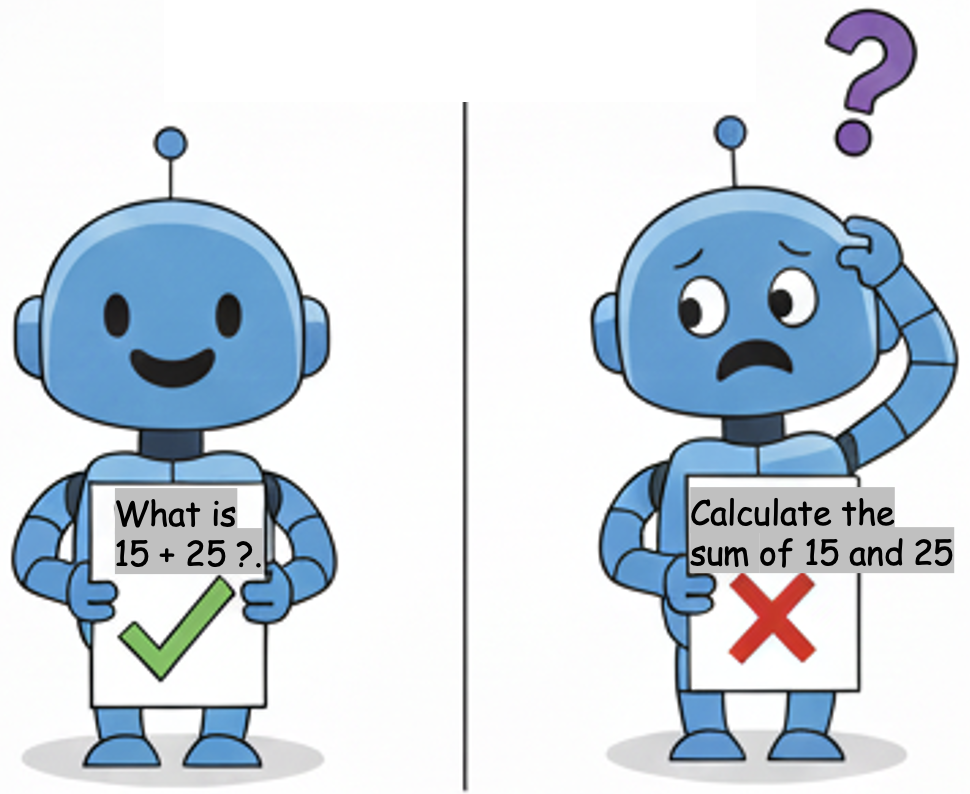
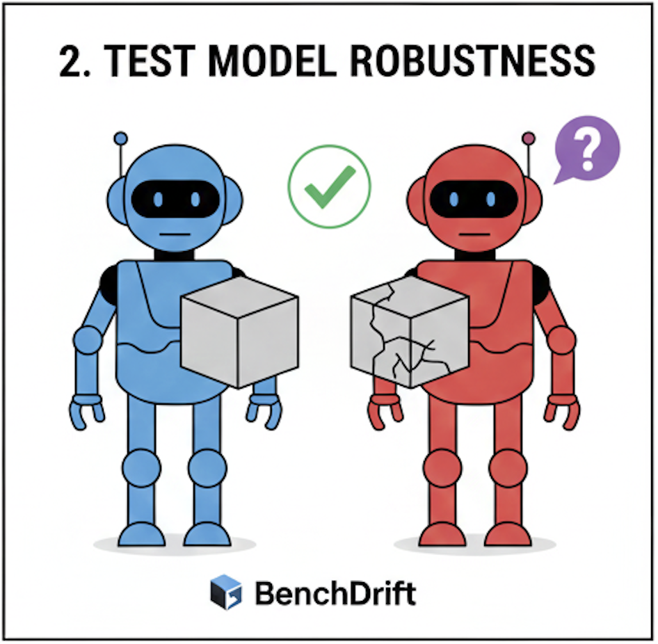
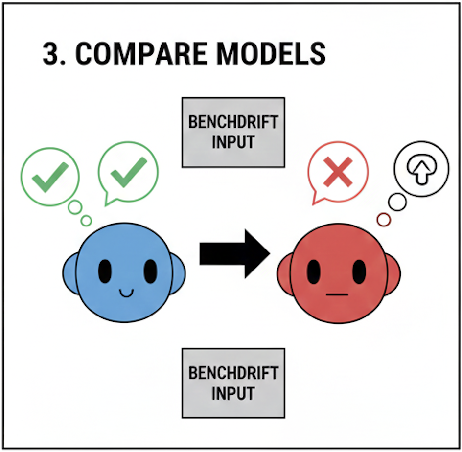
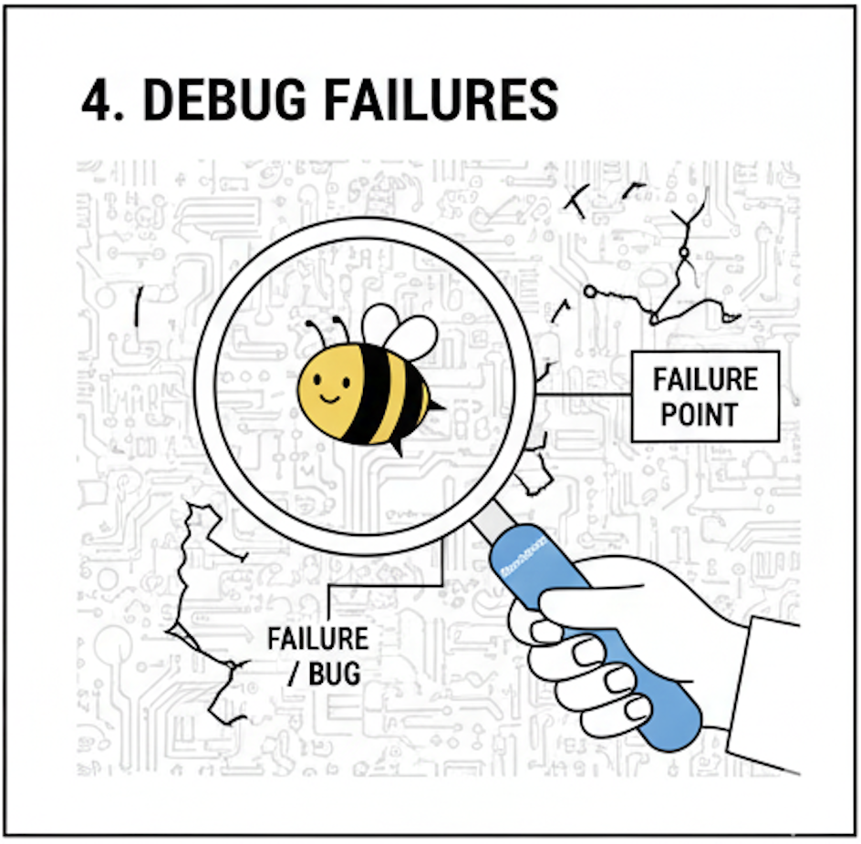

# BenchDrift

**Struggling to find edge cases for your prompts? Wondering why different models interpret the same problem differently?**

BenchDrift automatically generates syntactic variations of your test problems (preserving semantic meaning) to reveal hidden model brittleness, discover edge cases, and detect performance drift — helping you debug failing tasks and validate model robustness.

## What is BenchDrift?

BenchDrift generates syntactic variations of test problems (same meaning, different presentation) and detects when model performance changes unexpectedly (drift detection).

**Example:** Your model solves "What is 15 + 25?" correctly but fails on "Calculate the sum of 15 and 25" — BenchDrift finds these inconsistencies automatically.

<p align="left">
  
</p>

**Use BenchDrift to:**
- **Discover edge cases** - Automatically generate test variations you didn't think of
- **Test model robustness** - Does your model fail on simple rephrasing?
- **Compare models** - See how different models interpret the same problem
- **Debug failures** - Find exactly which variations break your model
- **Validate prompts** - Ensure consistent performance across stylistic variations

<p align="center">
  
  
  
  
</p>


## How It Works

BenchDrift uses a **variation taxonomy** developed from analyzing drifts observed across benchmark problems in multiple domains: math, natural language, temporal reasoning, long context, logical propositions, and more. This taxonomy guides the generation of surface-form variations (preserving meaning) that are most likely to reveal model brittleness.

## Pipeline Stages

1. **Variations** - Generate syntactic variations of input problems (same meaning, different form)
2. **Validation** - Validate that variations are equivalent to originals
3. **Responses** - Get model responses for all variations
4. **Evaluation** - Detect positive/negative drift in model performance

## Quick Start

```bash
# Install
pip install -e .

# Run demo notebook
jupyter notebook notebooks/demo_semantic.ipynb
```

## Documentation

See [docs/INSTALLATION.md](docs/INSTALLATION.md) for detailed setup.
Other documents:
- **[docs/RUNNING_THE_PIPELINE.md](docs/RUNNING_THE_PIPELINE.md)** - How to run individual stages, configure parameters
- **[docs/LONG_CONTEXT_VARIATIONS_README.md](docs/LONG_CONTEXT_VARIATIONS_README.md)** - Long context variation types
- **`config/model_config.yaml`** - Available RITS models and configurations

## Configuration

```python
config = {
    'verbose': False,  # Clean output (progress bars + drift alerts only)
    'use_generic': False,
    'use_persona': False,
    'use_long_context': True,
    'use_cluster_variations': False,
}
```

All logs saved to `logs/pipeline_debug.log`.

<!-- ## Variation Types

- **Generic** - Counterfactual, rephrasing
- **Persona** - Scientist, artist, engineer perspectives
- **Long Context** - Structure/positioning for prompts >500 chars
- **Cluster-based** - Semantic similarity variations -->

<!-- ## Results

### Drift Detection Analysis


### Variation Type Breakdown
 -->

## Repository Structure

```
BenchDrift-Pipeline/
├── src/
│   ├── pipeline/      # Main pipeline code
│   ├── models/        # Model clients
│   └── eval/          # Evaluation & visualization
├── notebooks/         # Demo notebooks
├── data/             # Input/output data
├── config/           # Model configurations
├── docs/             # Documentation
├── figures/          # System and result figures
└── logs/             # Pipeline logs
```
